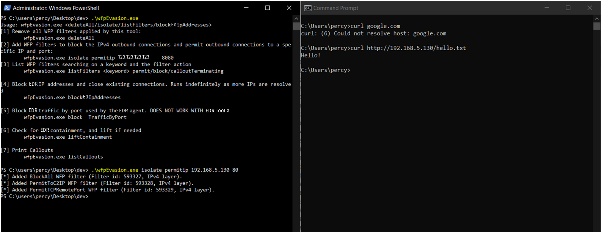
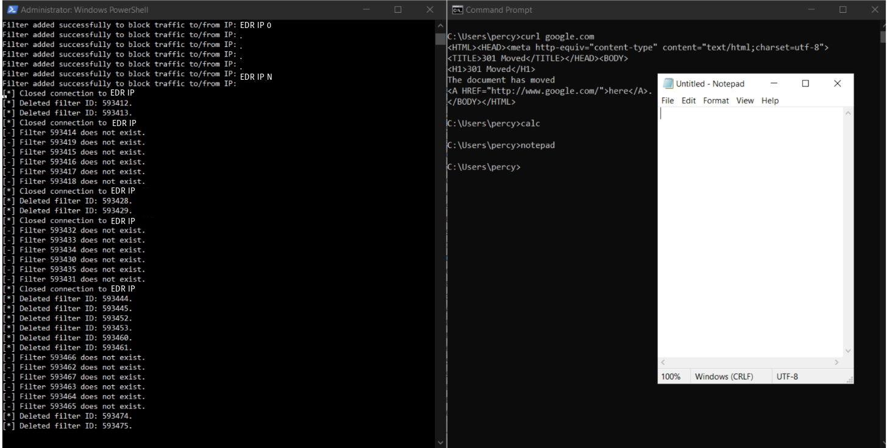

This post provides a comprehensive analysis of how EDR software leverages the Windows Filtering Platform (WFP) to manage network filtering capabilities. Using this knowledge, we can better understand how an attacker may disable features of EDR sensors, such as sending telemetry to the cloud, network containment, firewall rules, and more, to evade defenses.

All testing was done on a single EDR tool. Some EDR tools may use WFP differently, but techniques performed here should apply to other EDR tools. 

**All testing was performed in January 2024 and reported to the EDR vendor. Since, EDR vendors may have release new controls to prevent this technique**

# Background

WFP is a platform provided by Windows that allows external software vendors to modify, monitor, and filter TCP/IP traffic, as well as remote procedure calls (RPCs). WFP is frequently utilized by Endpoint Detection and Response (EDR), antivirus, and Intrusion Prevention/Detection Systems (IPS/IDS) software. EDR software uses the functionality of WFP to log incoming and outbound network connections, provide data about processes making RPCs, network contain devices, and allow communications to the cloud.

This section reviews the components of the Windows Filtering Platform utilized by EDR software, including potential points of exploitation for an attacker.

## WFP Providers

A WFP Provider is a WFP object that is used solely for management purposes. Upon creation of a filter, a provider key can be specified, which associates the filter with a specific service. EDR software may configure persistent providers named accordingly, with descriptions related to their services. All WFP filters created by these EDR software will likely be created under their respective providers. This screenshot shows the output of the provider tab of [WFP Explorer](https://github.com/zodiacon/WFPExplorer) on a device with an EDR tool installed.

## WFP Filters

WFP filters network traffic through its filter engine, which has both user-mode and kernel-mode components that work together to handle all the network filtering operations. The filter engine has multiple layers that roughly align with the operating system’s networking stack layers.

The user-mode component deals with things like Remote Procedure Calls (RPCs), Internet Key Exchange (IKE), and IPSec filtering, while the kernel-mode component handles filtering at the network and transport layers of the TCP/IP stack.

Applications, like EDR software, configure traffic filtering by adding WFP filters to the filter engine. By using a tool like WFPExplorer, we can see all the filters that EDR software has created.

The image above shows that, by default, some EDR systems create a bunch of filters. Most of these filters are set up with a Callout Terminating action, which is explained more in the next section. The remaining filters (not all shown) use the Permit action.

These filters also have some interesting flags, like `FWPM_FILTER_FLAG_PERSISTENT` or `FWPM_FILTER_FLAG_BOOTTIME`. When the boottime flag is set, it makes sure the filter is enforced right from the start, even before the user-mode filter engine kicks in. The persistent flag ensures that the filter sticks around even if the user-mode filter engine starts or stops.

Each filter can have one or more conditions that determine if the filter's action should be applied to the matching traffic. For example, in this image you can see how these conditions work in the permit filters mentioned above.

This filter has three conditions. The first one, the IP Local Port condition, is matched when the local port of an IPv4 connection matches the hexadecimal number `0x7440` (which is `29760` in decimal). The second condition, the IP Protocol, matches when the protocol is TCP (protocol #6 according to RFC 1700). The third condition checks if any filtering condition flags are set.

By running the command `netstat -ano`, we can identify the connection that the EDR sensor establishes with the cloud. Notice how the local port matches the one specified in the WFP filter. It is plausible that the EDR software employs this filter to ensure uninterrupted connections to the EDR's cloud component, preventing blockage by other filters.

Furthermore, EDR software uses WFP filters to block traffic when a device is under network containment, as expected. When a device is contained, the EDR sensor adds multiple block filters at the ALE Connect and Receive/Accept V4/V6 layers. These filters don’t have any specific conditions, so all traffic for these layers gets blocked.

EDR sensors may also creates several filters with the permit action to allow necessary traffic. For example, the following filter allows DHCP traffic by allowing UDP traffic from local port 67 to remote port 68. The ALE User ID specifies the SID for the DHCP Client Service.

Other permit filters that get added during EDR containment allow traffic to specific IP addresses outlined in the containment policy. For example, in this policy, I specified that I wanted to allow traffic to `205.185.208.98`, which is a MalwareBytes IP address. Upon containment, we observed a filter added with the following conditions.

If we convert that hexadecimal value `0xCDB9D062` to an IPv4 address, we see that this filter is permitting connections to `205.185.208.98`

## WFP Callouts

WFP callouts are functions provided by a callout driver that are used for specialized filtering. Beyond the basic permit and block actions, callouts can modify and secure inbound and outbound network traffic. Once a callout function is defined in a callout driver (like the EDR driver), these functions can be registered as callouts for use by the filtering engine. WFP filters can then be set up to trigger these callout functions when the filter conditions are met.

The following filter is one of the default filters created by the EDR software with a callout terminating action. This action triggers a callout that always returns a block or permit decision when the filter conditions are met.

Information about the EDR callouts couldn't be retrieved. When searching for callouts that match the callout key shown in the filter above, no results were found. I tried elevating privileges to SYSTEM but still couldn’t locate any. These callouts might be restricted to a specific security descriptor used by the EDR system. When attempting to open the EDR's callout terminating filters in WFPExplorer, the program crashed, likely due to permission issues. This is something I'd like to chase down in the future.

Above was my attempt to list the callouts using a custom tool. As you can see there are no results. If appropriate permissions to access these filters were obtained, it might be possible to exploit the callouts/filters to circumvent the EDR's network controls.

# Hypothesis

Based on the background information, the hypothesis is: manipulation of the WFP filters and callouts used by EDR systems could potentially allow an attacker to bypass or evade the EDR's network controls, security measures, and logging capabilities. This hypothesis suggests that by understanding and exploiting the functionality of the Windows Filtering Platform, an attacker could disable key features of the EDR sensors, such as sending telemetry to the cloud, network containment, and firewall rules.

## Testing Environment
 - Up to date EDR Sensor as of January 2024
 - Windows 10 - 19044

## Test Case 1: Lift Network Containment by Deleting EDR Block Filters
*Hypothesis*: A malicious actor could lift the EDR's network containment on a device by removing the blocking WFP filters that enforce containment

### Procedure:
1. Get keys for all filters using fwpmu.h - FwpmFilterEnum0() and filter results where “filter->action.type = FWP_ACTION_BLOCK” and “filter->displayData.name contains "EDR NAME"
2. Delete the identified block filters from the Windows Filtering Platform using “fwpmu.h - FwpmFilterDeleteByKey0()”
3. Verify that the network containment is lifted, and traffic is allowed by web browsing.

### Validation:

## Test Case 2: Network Contain Device While Allowing C2 Traffic
*Hypothesis*: A malicious actor could potentially enforce network containment on a device by adding block filters for all traffic (including EDR telemetry), except for traffic to a C2 IP address.

### Procedure:
1. Add a block filter for all traffic that matches the layer FWPM_LAYER_ALE_AUTH_CONNECT_V4 with a higher weight then all EDR filters. Uses fwpmu.h - FwpmFilterAdd0()
2. Add permit filter to allow all traffic at layer FWPM_LAYER_ALE_AUTH_CONNECT_V4 where the IP address is the C2 IP address
3. Add permit filter to allow all traffic at layer FWPM_LAYER_ALE_AUTH_CONNECT_V4 where the protocol is TCP and the remote port is the C2 port

### Validation:

## Test Case 3: Blocking EDR Telemetry While Allowing All Other Traffic
*Hypothesis*: A malicious actor could potentially block all telemetry to the EDR's cloud component by deleting the EDR's WFP filters, adding block filters for all EDR cloud component IPs, and terminating any new TCP connections to the EDR's cloud component.

### Procedure:
1. Kill all active connections to the EDR cloud by blocking ALL outbound connections. This uses the method described in step 1 in Test Case 2.
2. Delete all filters created in previous step after 60 seconds
3. Delete all EDR permit filters
4. Enumerate all EDR filters using fwpmu.h - FwpmFilterEnum0() and filter results where filter->displayData.name contains "EDR NAME" and delete using fwpmu.h - FwpmFilterDeleteByKey()
5. Dynamically resolve EDR cloud domains - using ws2tcpip.h - getaddrinfo().
6. If block filter doesn’t already exist for the resolved IP, create a new block filter using fwpmu.h - FwpmFilterAdd0()
7. Kill any active TCP connections with enumerated EDR IP address using iphlpapi.h - SetTcpEntry()
8. Infinitely loop steps 3-7

### Validation:

## References
[https://scorpiosoftware.net/2022/12/25/introduction-to-the-windows-filtering-platform/](https://scorpiosoftware.net/2022/12/25/introduction-to-the-windows-filtering-platform/)

[https://github.com/netero1010/EDRSilencer](https://github.com/netero1010/EDRSilencer)

[https://github.com/zodiacon/WFPExplorer](https://github.com/zodiacon/WFPExplorer)

[https://learn.microsoft.com/en-us/windows/win32/fwp/windows-filtering-platform-architecture-overview](https://learn.microsoft.com/en-us/windows/win32/fwp/windows-filtering-platform-architecture-overview)

[https://learn.microsoft.com/en-us/windows/win32/api/fwpmu/](https://learn.microsoft.com/en-us/windows/win32/api/fwpmu/)

[https://learn.microsoft.com/en-us/windows/win32/api/fwptypes/](https://learn.microsoft.com/en-us/windows/win32/api/fwptypes/)